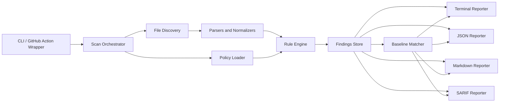

# Architecture

## Overview

Security First Aid is designed as a deterministic scanning platform with a small auditable core and well-defined extension points.

The architecture is intentionally modular so contributors can add checks without coupling parsing, reporting, and policy logic.

## Architecture principles

- Deterministic first
- Local-first by default
- Clear trust boundaries
- Parsers separate from rules
- Rules separate from reporters
- Stable finding schema across all outputs

## High-level components



## Component responsibilities

### CLI / GitHub Action wrapper

- parse user flags and mode
- resolve configuration
- invoke the orchestrator
- set process exit codes

### Scan orchestrator

- coordinate discovery, parsing, rule execution, baseline matching, and reporting
- handle partial failure and collect diagnostics

### File discovery

- walk the target path
- apply include and exclude patterns
- classify candidate files by type

### Parsers and normalizers

- parse structured inputs
- convert format-specific data into canonical internal shapes
- attach parser diagnostics

### Rule engine

- select applicable rules by artifact type and policy
- execute rules deterministically
- collect findings and rule execution metadata

### Findings store

- maintain in-memory normalized findings during a scan
- generate stable fingerprints for baselining

### Baseline matcher

- suppress accepted findings by fingerprint and policy
- keep suppressed findings available in machine output when requested

### Reporters

- render findings in target formats
- enforce redaction policy
- preserve stable field names and output semantics

## Proposed package structure

```text
packages/
  cli/
  core/
  parsers/
  rules-core/
  reporters/
  github-action/
  fixtures/
  docs-site/            # optional later
```

## Domain model

### Artifact

Represents a discovered file or logical input unit.

Fields:

- path
- type
- language or format
- parser metadata
- normalized payload

### Rule

Represents one deterministic check.

Fields:

- id
- title
- category
- applicable artifact types
- default severity
- version

### Finding

Represents one emitted issue.

Fields:

- fingerprint
- ruleId
- title
- severity
- category
- filePath
- location
- summary
- rationale
- evidence
- remediation
- references

### Policy

Defines repository-level control over scanner behavior.

Fields:

- enabled rules
- disabled rules
- severity threshold
- redaction level
- baseline path

## Trust boundaries

### Trusted

- scanner runtime
- local repository contents being scanned
- checked-in rule definitions

### Semi-trusted

- repository configuration files
- workflow definitions
- contributor-authored suppressions and baselines

### Untrusted

- malformed files
- intentionally adversarial repository content
- third-party artifacts in vendored directories

## Security design requirements

- Never execute repository code during scanning.
- Avoid shelling out to repository-local tooling in the core engine.
- Treat all parsed content as data, not executable input.
- Redact sensitive values in output unless explicitly requested in a secure local mode.

## Failure model

- Parser failure produces a diagnostic artifact, not a full scan abort.
- Rule failure produces a structured execution error and continues the scan.
- Reporter failure must not mutate or hide findings already produced.

## Observability requirements

The product should emit:

- scan duration
- files scanned
- files skipped
- parser errors
- rules executed
- findings by severity

These metrics should remain local unless the user explicitly exports them.

## Extension model

Future growth should happen through:

- new artifact parsers
- additional rule packs
- new reporters
- optional remote enrichers in a separate opt-in package

The deterministic core must remain usable without any optional modules.
