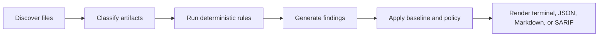
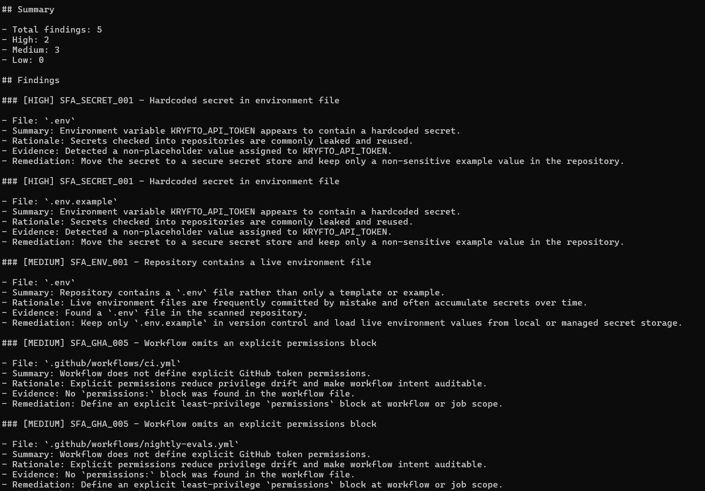

# Security First Aid


Security First Aid is a deterministic, local-first security scanner for repositories, GitHub Actions workflows, Dockerfiles, and common application configuration.

It is built for open-source maintainers, solo developers, and small teams that need one thing from security tooling: show the risky mistakes, explain why they matter, and tell them what to fix first.

## Table of Contents

- [Why this exists](#why-this-exists)
- [How it works](#how-it-works)
- [What is implemented](#what-is-implemented)
- [Quick start](#quick-start)
- [Install options](#install-options)
- [Example output](#example-output)
- [How to make it work with npm and npx](#how-to-make-it-work-with-npm-and-npx)
- [Usage](#usage)
- [Repository policy](#repository-policy)
- [GitHub Action](#github-action)
- [Rule coverage](#rule-coverage)
- [Development](#development)
- [Project structure](#project-structure)
- [Documentation map](#documentation-map)
- [Troubleshooting](#troubleshooting)
- [License](#license)

## Why this exists

Most security tools miss the target for smaller teams:

- they are too shallow and produce lint-like warnings without context
- they are too noisy and bury real risk under hundreds of findings
- they assume the user already knows how to interpret security jargon

Security First Aid is intentionally opinionated:

- deterministic first
- local-first by default
- no outbound telemetry in the core scanner
- high-signal checks over broad, noisy coverage
- plain-English remediation over vague compliance language

## How it works



At a high level:

1. Security First Aid walks the target repository and discovers security-relevant files.
2. It classifies those files into known artifact types such as workflow YAML, Dockerfiles, `.env` files, and JSON config.
3. It runs narrow deterministic rules against those artifacts.
4. It normalizes the findings into a stable schema.
5. It applies repository policy and baseline suppression.
6. It renders the results in human-readable or machine-readable formats.

## What is implemented

The current codebase includes:

- a production-grade Node.js CLI
- recursive artifact discovery
- deterministic rule execution
- repository policy loading from `.sfa.json`
- baseline creation and baseline suppression
- terminal, JSON, Markdown, and SARIF reporters
- fixture-backed tests with Node's built-in test runner
- a reusable GitHub Action wrapper

The current v1 rule pack implements 15 deterministic checks across:

- secrets exposure
- committed environment files
- GitHub Actions permissions and trigger misuse
- workflow pipe-to-shell behavior
- Docker privilege and image hygiene basics
- debug mode leakage
- insecure CORS, cookies, and session configuration

## Quick start

Run the CLI directly from the repository:

```bash
npx security-first-aid@latest scan . --format terminal
```

Or install it globally:

```bash
npm install -g security-first-aid
sfa scan . --format terminal
```

Recommended first run after install:

```bash
npm install -g security-first-aid@latest
sfa
```

Then run one of these:

```bash
sfa scan . --format terminal
sfa rules list --format json
sfa baseline create . --output ./.sfa-baseline.json
```

Important: npm may not always show lifecycle output clearly during `npm install -g`, depending on the user's npm configuration. The reliable built-in guide is `sfa` or `sfa --help`.

If you just want the built-in guide:

```bash
npx security-first-aid@latest
```

or:

```bash
sfa --help
```

You can still run the CLI directly from the repository:

```bash
node ./src/cli/index.js scan . --format terminal
```

Generate a Markdown report:

```bash
node ./src/cli/index.js scan . --format markdown --output ./reports/security-report.md
```

Create a baseline from current findings:

```bash
node ./src/cli/index.js baseline create . --output ./.sfa-baseline.json
```

List the available rules:

```bash
node ./src/cli/index.js rules list --format json
```

## Install options

### Option 1: Install from npm

```bash
npm install -g security-first-aid@latest
```

Then immediately run:

```bash
sfa
```

Then choose a command:

```bash
sfa scan . --format terminal
sfa rules list --format json
```

### Option 2: Run with npx

```bash
npx security-first-aid@latest scan . --format terminal
```

To show the built-in quick-start guide instead of running a scan:

```bash
npx security-first-aid@latest
```

### Option 3: Run from source

This is the simplest option while developing or testing locally:

```bash
node ./src/cli/index.js scan . --format terminal
```

### Option 4: Link it globally from this repository

From the repository root:

```bash
npm link
```

That exposes the binary defined in `package.json`:

```bash
sfa scan . --format terminal
sfa rules list --format json
```

### Option 5: Install the packed tarball locally

Create a distributable package:

```bash
npm pack
```

Install that tarball globally:

```bash
npm install -g ./security-first-aid-0.1.2.tgz
```

Then run:

```bash
sfa scan . --format terminal
```

## Example output

Real Markdown report excerpt captured from the project:



Generate a comparable report from any repository with:

```bash
sfa scan . --format markdown --output ./reports/security-report.md
```

Terminal output example from the bundled insecure fixture:

```text
Security First Aid
Target: ./tests/fixtures/insecure-service
Findings: 15
High: 6  Medium: 7  Low: 2

[HIGH] SFA_SECRET_001 .env - Environment variable SECRET_KEY appears to contain a hardcoded secret.
[HIGH] SFA_GHA_001 .github/workflows/deploy.yml - GitHub Actions workflow grants write-all permissions.
[HIGH] SFA_GHA_003 .github/workflows/deploy.yml - Workflow is triggered by pull_request_target.
[HIGH] SFA_GHA_004 .github/workflows/deploy.yml - Workflow uses curl piped to bash.
[HIGH] SFA_CONFIG_003 config.json - Session cookie configuration disables the secure flag.
[HIGH] SFA_CONFIG_005 config.json - Configuration combines wildcard CORS origins with credentialed requests.
[MEDIUM] SFA_ENV_001 .env - Repository contains a `.env` file rather than only a template or example.
```

## How to make it work with npm and npx

The package metadata needed for npm and npx is already in place:

- package name: `security-first-aid`
- executable binary: `sfa`
- entry point: `./src/cli/index.js`
- publishable file whitelist: `src`, `CHANGELOG.md`, `README.md`, `LICENSE`

The package is now published to the npm registry as `security-first-aid`.

### Publish workflow

Future releases can be shipped through GitHub Actions instead of repeating the manual publish sequence.

Automated release path:

1. update `package.json` to the target version
2. add the matching release section to `CHANGELOG.md`
3. commit the release changes
4. push a tag like `v0.1.2`

The `Release` workflow will:

- validate version and changelog consistency
- run the release verification suite
- build a tarball and SHA-256 checksum
- publish to npm using the repository `NPM_TOKEN` secret
- create a GitHub release using the matching changelog notes

Required GitHub secret:

- `NPM_TOKEN`

Verify the packed contents:

```bash
npm pack --dry-run
```

Log in to npm:

```bash
npm login
```

If the unscoped name `security-first-aid` is available, publish it:

```bash
npm publish
```

If the name is already taken, switch to a scoped name such as `@your-org/security-first-aid` in `package.json`, then publish it publicly:

```bash
npm publish --access public
```

### After publishing

Users can install it globally with npm:

```bash
npm install -g security-first-aid
```

Or run it directly with npx:

```bash
npx security-first-aid@latest scan . --format terminal
```

If you publish under a scope, use the scoped package name instead:

```bash
npx @your-org/security-first-aid@latest scan . --format terminal
```

Current published version:

- `security-first-aid@0.1.2`

## Usage

### Scan a repository

```bash
sfa scan <target-path> [options]
```

Supported options:

- `--format json|markdown|sarif|terminal`
- `--baseline <path>`
- `--config <path>`
- `--severity-threshold low|medium|high|critical`
- `--output <path>`

Examples:

```bash
sfa scan . --format terminal
sfa scan . --format json --severity-threshold medium
sfa scan . --format sarif --baseline ./.sfa-baseline.json
sfa scan . --format markdown --output ./reports/report.md
```

### Create a baseline

```bash
sfa baseline create <target-path> [options]
```

Examples:

```bash
sfa baseline create .
sfa baseline create . --output ./.sfa-baseline.json
```

### List the rule catalog

```bash
sfa rules list [--format json|markdown|terminal]
```

Examples:

```bash
sfa rules list
sfa rules list --format json
sfa --help
```

## Repository policy

Security First Aid automatically looks for a `.sfa.json` file in the scan target root unless you pass `--config`.

Example:

```json
{
  "enabledRules": ["SFA_SECRET_001", "SFA_GHA_003"],
  "disabledRules": ["SFA_CONFIG_001"],
  "severityThreshold": "high",
  "baselinePath": "./.sfa-baseline.json"
}
```

Supported fields:

- `enabledRules`
- `disabledRules`
- `severityThreshold`
- `baselinePath`

Precedence:

1. CLI flags
2. `.sfa.json`
3. built-in defaults

## GitHub Action

This repository includes a reusable composite action at `.github/actions/run-sfa/action.yml`.

Minimal example:

```yaml
name: Security Scan

on:
  pull_request:
  push:

jobs:
  scan:
    runs-on: ubuntu-latest
    steps:
      - uses: actions/checkout@v4
      - uses: actions/setup-node@v4
        with:
          node-version: 22
      - uses: ./.github/actions/run-sfa
        with:
          target-path: .
          format: terminal
          severity-threshold: high
```

Supported action inputs:

- `target-path`
- `format`
- `severity-threshold`
- `baseline`

## Rule coverage

### Secrets and environment files

- `SFA_SECRET_001` hardcoded secret in environment file
- `SFA_ENV_001` live `.env` file present in repository

### GitHub Actions

- `SFA_GHA_001` workflow uses `write-all` permissions
- `SFA_GHA_002` workflow action pinned to moving ref
- `SFA_GHA_003` workflow uses `pull_request_target`
- `SFA_GHA_004` workflow pipes remote content into a shell
- `SFA_GHA_005` workflow omits explicit permissions block

### Docker

- `SFA_DOCKER_001` Dockerfile missing non-root user
- `SFA_DOCKER_002` Dockerfile uses floating `latest` tag
- `SFA_DOCKER_003` Dockerfile uses `ADD` instead of `COPY`

### Application config

- `SFA_CONFIG_001` debug mode enabled in JSON config
- `SFA_CONFIG_002` wildcard CORS origin in JSON config
- `SFA_CONFIG_003` session cookie secure flag disabled
- `SFA_CONFIG_004` session cookie httpOnly flag disabled
- `SFA_CONFIG_005` wildcard CORS combined with credentials

## Development

### Prerequisites

- Node.js 22 or newer
- npm

This repository currently has no external runtime dependencies.

### Run the tests

```bash
node --test --experimental-test-isolation=none
```

### Run the smoke verification

```bash
node scripts/smoke.mjs
```

### Useful commands

```bash
npm test
npm run check
npm run scan:fixture
npm run release:validate
npm run pack:check
npm run release:check
```

## Project structure

```text
src/
  application/      scan orchestration
  cli/              CLI entry points and argument parsing
  domain/           findings, policy, and rule catalog logic
  infrastructure/   filesystem and artifact discovery
  reporters/        terminal, JSON, Markdown, and SARIF output
  rules/            deterministic security checks
tests/
  application/      orchestration tests
  cli/              CLI behavior tests
  reporters/        reporter tests
  fixtures/         secure and insecure sample repositories
docs/
  reference/        CLI and configuration reference
  sop/              operating procedures
  adr/              architecture decisions
```

## Documentation map

- [PRD.md](./PRD.md) - product requirements and v1 scope
- [ARCHITECTURE.md](./ARCHITECTURE.md) - system architecture and trust boundaries
- [ROADMAP.md](./ROADMAP.md) - phased delivery plan
- [SECURITY.md](./SECURITY.md) - disclosure and secure development policy
- [CONTRIBUTING.md](./CONTRIBUTING.md) - contributor workflow and quality gates
- [docs/reference/cli.md](./docs/reference/cli.md) - CLI command reference
- [docs/reference/configuration.md](./docs/reference/configuration.md) - `.sfa.json` format
- [docs/testing-strategy.md](./docs/testing-strategy.md) - test strategy
- [AGENTS.md](./AGENTS.md) - operating instructions for AI coding agents and contributors

## Troubleshooting

### `sfa` is not found

If you linked or installed the package globally and `sfa` is not available:

```bash
npm link
```

Or reinstall the tarball/global package:

```bash
npm install -g ./security-first-aid-0.1.2.tgz
```

### PowerShell blocks `sfa.ps1`

PowerShell may prefer a generated `sfa.ps1` shim. If that shim is blocked by execution policy, use:

```bash
sfa.cmd scan . --format terminal
```

Or:

```bash
cmd /c sfa scan . --format terminal
```

### `npx security-first-aid` does not work

That only works after the package is published to npm. Before publishing, use one of these:

- `node ./src/cli/index.js ...`
- `npm link` then `sfa ...`
- `npm pack` then `npm install -g ./security-first-aid-0.1.2.tgz`

## License

[MIT](./LICENSE)
